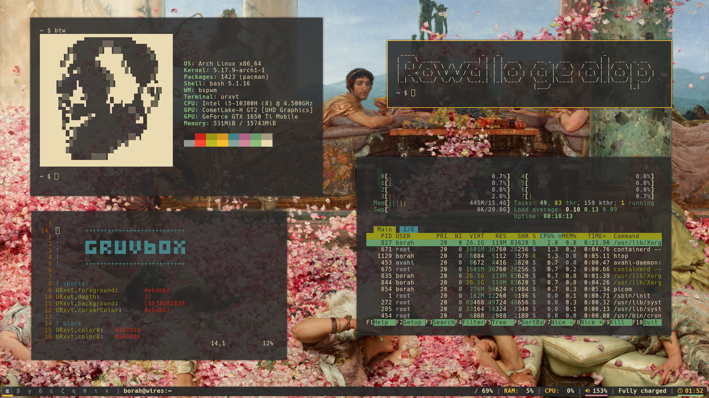

# BSPWM + Polybar (gruvbox) Arch rice



<hr>

## Packages needed:

- bspwm (your window manager)
- sxhkd (hotkey daemon for your keyboard shortcuts)
- polybar (status bar)
- rxvt-unicode (terminal emulator)
- dmenu (dynamic menu for launching stuff)
- picom (compositor for window effects)
- feh (wallpaper/image viewer)
- dunst (notification daemon)
- figlet (for those large text in the terminal)

```
sudo pacman -S bspwm sxhkd polybar rxvt-unicode dmenu picom feh dunst figlet
```

<hr>

## Extras:

- Font(Hack Nerd Font) from [here](https://github.com/ryanoasis/nerd-fonts)
- redshift-minimal<sup>(AUR)</sup> (for screen temperature adjustment)
- flameshot (screenshot utility)
